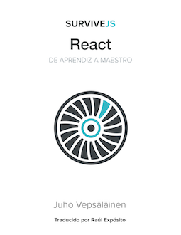

 

# SurviveJS - React

> **¡IMPORTANTE!** Si quieres apoyar el desarrollo de este libro puedes [comprar una copia en Leanpub](https://leanpub.com/survivejs-react). También hay [una versión en papel disponible a través de Amazon](http://www.amazon.com/SurviveJS-Webpack-React-apprentice-master/dp/152391050X/) (se trata de una versión anterior que cubre tanto Webpack como React).

Este libro te muestra cómo construir una pequeña aplicación de tipo Kanban utilizando React. Durante el proceso aprenderás los conceptos básicos y serás capaz de adquirir habilidades con las que desarrollar tus propios proyectos. Puedes [leer el libro online](http://survivejs.com/react/introduction/).

## ¿Cómo Utilizar este Repositorio?

El repositorio ha sido dividido en dos partes principales: `manuscript` (manuscrito) y `project_source` (código fuente). Puedes encontrar los capítulos gratuitos bajo `manuscript` organizados por capítulos. `project_source` contiene el código fuente asociado a cada capítulo..

No existe una manera correcta de utilizar este libro. Todo depende de tu experiencia previa y del interés que tengas. Puedes construir el proyecto desde cero siguiendo el libro o puedes comenzar desde un punto específico. Tan sólo utiliza el código fuente del capítulo anterior como punto de salida.

Por favor, observa que la rama por defecto del libro en este repositorio es `dev`. `master` contiene el código fuente de la versión más reciente. Cada versión ha sido etiquetada de esta manera, así que es fácil encontrar el código fuente de la versión del libro que estés leyendo.

## Cómo Obtener Soporte

Dado de ningún libro es perfecto, puede que quieras presentarme cuestiones y problemas que te hayan surgido relacionadas con el contenido. Hay un par de formas de conseguirlo:

* Contacta conmigo a través de [el sistema de incidencias de GitHub](https://github.com/survivejs/react/issues)
* Súmate [al chat de Gitter](https://gitter.im/survivejs/react)
* Sigue [@survivejs](https://twitter.com/survivejs) en Twitter para recibir novedades oficiales o dame un codazo directamente a través de [@bebraw](https://twitter.com/bebraw)
* Mándame un correo a [info@survivejs.com](mailto:info@survivejs.com)
* Pregúntame cualquier cosa sobre Webpack o React en [SurviveJS AmA](https://github.com/survivejs/ama/issues)

Si haces preguntas en [Stack Overflow](http://stackoverflow.com/search?q=survivejs), etiquétalas utilizando [**survivejs**](https://stackoverflow.com/questions/tagged/survivejs) para que pueda recibir notificaciones. También puedes utiliza el hashtag **#survivejs** en Twitter.

## Notificaciones

Notifico noticias relacionadas con SurviveJS en un par de canales:

* [Lista de Correo](http://eepurl.com/bth1v5)
* [Twitter](https://twitter.com/survivejs)
* [RSS del Blog](http://survivejs.com/atom.xml)

Siéntete libre de subscribirte.

## Cómo Contribuir

¡Tanto el feedback como los pull requests son bienvenidos! Echa un vistazo a *CONTRIBUTING.md* para obtener más información.

## Licencia

